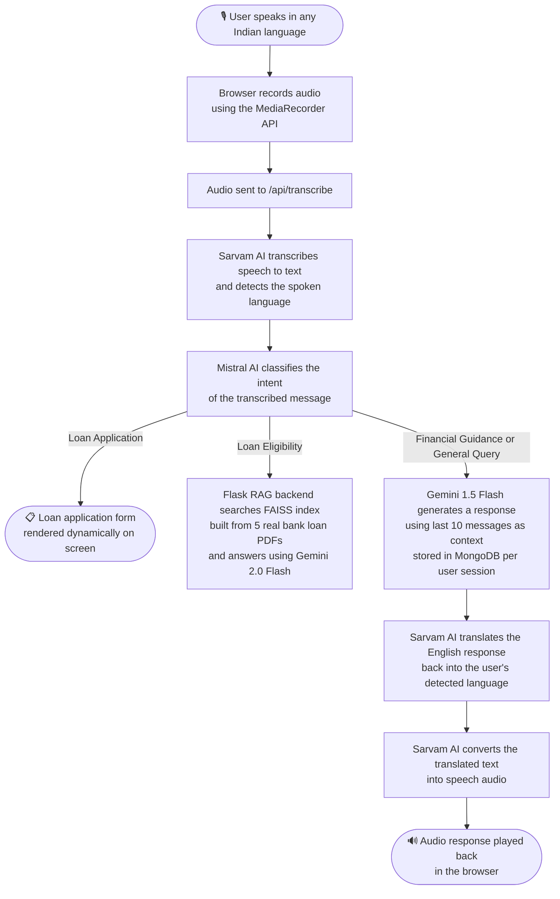
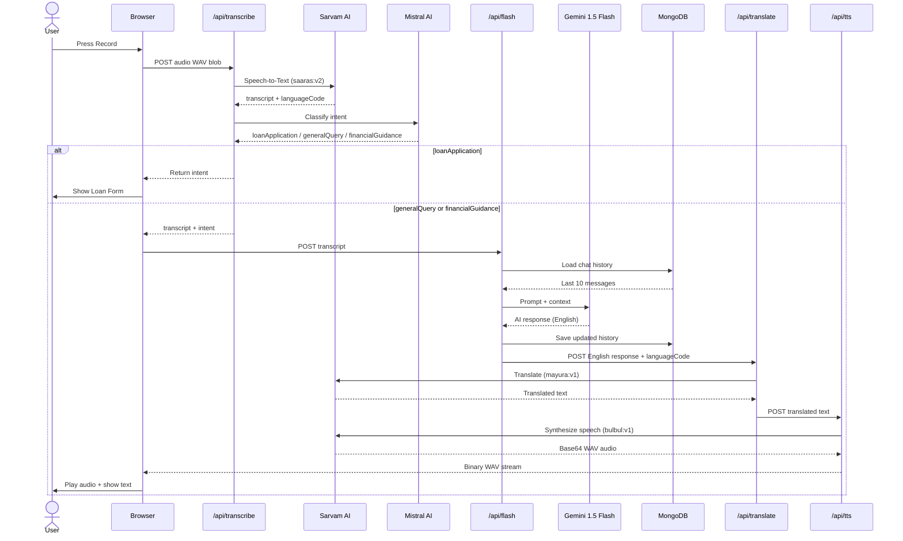

<div align="center">

<br/>

<h1>🏦 FinTok 2.0</h1>

<h3><em>AI-Powered Multilingual Financial Voice Assistant</em></h3>

<br/>

<a href="https://nextjs.org/"></a>
<a href="https://python.org/"></a>
<a href="https://flask.palletsprojects.com/"></a>
<a href="https://mongodb.com/"></a>
<a href="https://typescriptlang.org/"></a>
<a href="https://ai.google.dev/"></a>
<a href="https://sarvam.ai/"></a>
<a href="https://mistral.ai/"></a>

<br/><br/>

<p><strong>FinTok 2.0</strong> is a voice-first financial advisory platform that lets users speak in <strong>any Indian language</strong> and receive contextual financial guidance, loan eligibility checks, and application assistance — fully voiced back in their native language.</p>

<br/>

<hr/>

</div>

## 🎯 The Problem

Over **500 million** Indians remain underserved by financial services — not due to lack of need, but due to **language barriers and digital literacy gaps**. Most fintech platforms require users to read and type in English, navigate complex forms, and understand financial jargon.

**FinTok 2.0 removes all three barriers.** Users press a button and *talk* — in Hindi, Tamil, Telugu, Bengali, or any Indian language — and the platform handles the rest.

---

## ✨ Key Features

| Feature | Detail |
|---|---|
| 🎙️ **Voice-First Interface** | Browser `MediaRecorder API` — no external SDK needed |
| 🌐 **Multilingual ASR** | Sarvam `saaras:v2` auto-detects language + transcribes |
| 🧠 **4-Class Intent Classifier** | Mistral `mistral-small-latest` with keyword fallback |
| 💬 **Contextual AI Advisor** | Gemini 1.5 Flash with rolling 10-message memory per user |
| 🔊 **Native-Language TTS** | Sarvam `bulbul:v1` synthesizes response in detected language |
| 🌍 **AI Translation Layer** | Sarvam `mayura:v1` translates English AI response before TTS |
| 📋 **Adaptive Loan Form** | Dynamically rendered when `loanApplication` intent is detected |
| 📚 **RAG Loan Knowledge Base** | FAISS + Cohere embeddings over 5 real bank loan PDFs |
| 🔐 **Dual Auth System** | Google OAuth 2.0 + PBKDF2 salted credentials via NextAuth.js |
| 💾 **Persistent Chat History** | Per-user conversation history in MongoDB, linked by UUID |

---

## 🏗️ System Architecture



---

## 🔄 Complete Voice Pipeline



---

## 📁 Project Structure

```
FinTok2.0/
├── frontend/                      # Next.js 15 + TypeScript
│   ├── app/
│   │   ├── page.tsx               # Main chat UI — voice record, chat bubbles, loan form
│   │   ├── Components/
│   │   │   ├── Signin.tsx         # Animated auth form (Google OAuth + credentials)
│   │   │   ├── AudioPlayer.tsx    # Custom audio player
│   │   │   └── Form.tsx           # Dynamic loan application form
│   │   ├── api/
│   │   │   ├── transcribe/        # Sarvam STT + Mistral intent classifier
│   │   │   ├── flash/             # Gemini AI with MongoDB chat history
│   │   │   ├── translate/         # Sarvam translation
│   │   │   ├── tts/               # Sarvam TTS → binary audio
│   │   │   └── [...nextauth]/     # NextAuth.js handler
│   │   ├── models/
│   │   │   ├── User.ts            # email, salt, hashedPassword, oauthProvider
│   │   │   └── ChatHistory.ts     # userId, conversationId, messages[]
│   │   └── utils/
│   │       ├── asr_translate.ts   # Orchestrates full audio pipeline
│   │       ├── flash.ts           # Gemini client wrapper
│   │       ├── translate.ts       # Translation wrapper
│   │       ├── tts.ts             # TTS wrapper → returns ObjectURL
│   │       └── password.ts        # PBKDF2 hashing with CryptoJS
│   └── lib/
│       ├── auth.ts                # NextAuth config — Google + Credentials + JWT
│       └── mongodb.ts             # Singleton connection pool for serverless
│
└── backend/                       # Python + Flask RAG server
    ├── main.py                    # FAISS indexing + /query RAG endpoint
    └── docs/                      # 5 bank loan PDFs (knowledge base)
```

---

## 🧠 AI Stack

| Layer | Model | Purpose |
|---|---|---|
| Speech-to-Text | Sarvam `saaras:v2` | Multilingual ASR + language detection |
| Intent Classification | Mistral `mistral-small-latest` | Routes query to correct handler (4 classes, temp=0.1) |
| Conversational AI | Google `gemini-1.5-flash` | Financial Q&A with 10-message rolling context |
| Translation | Sarvam `mayura:v1` | English → user's native language (formal mode) |
| Text-to-Speech | Sarvam `bulbul:v1` | 24kHz WAV synthesis, Meera voice |
| RAG Embeddings | Cohere `embed-english-v2.0` | Vector embeddings for loan PDF chunks |
| Vector Search | FAISS (CPU) | Semantic search over loan knowledge base |

---

## 🔐 Authentication

Dual-provider auth via **NextAuth.js v5** with JWT sessions:

- **Google OAuth** — creates or retrieves a MongoDB `User` doc on first sign-in; prevents duplicate accounts across providers
- **Credentials** — PBKDF2 password hashing (`CryptoJS`, 512-bit key, 128-bit random salt, 1000 iterations); password strength enforced client-side with a live strength meter
- **Session** — stateless JWT; `user.id` injected into token and used to scope chat history per user in MongoDB

---

## 🧩 Key Technical Decisions

| Decision | Rationale |
|---|---|
| **Next.js API Routes as BFF** | API keys stay server-side — never exposed to the browser |
| **Sarvam over Whisper** | Purpose-built for Indian languages; higher accuracy on low-resource languages |
| **Mistral for intent, Gemini for QA** | Mistral is fast and cheap for classification; Gemini handles richer advisory responses |
| **FAISS over cloud vector DB** | Lightweight, fully local — no Pinecone/Weaviate overhead for a prototype |
| **Rolling 10-message context** | Balances conversation coherence with Gemini token cost |
| **Singleton DB connection** | Prevents MongoDB connection exhaustion across Next.js serverless cold starts |
| **JWT over DB sessions** | Stateless, edge-compatible, no session store required |

---

## 🚀 Getting Started

### Prerequisites
- Node.js ≥ 18, Python ≥ 3.10, MongoDB instance
- API keys: [Sarvam AI](https://sarvam.ai) · [Mistral](https://mistral.ai) · [Google AI Studio](https://aistudio.google.com) · [Cohere](https://cohere.com)

### Frontend
```bash
cd frontend && npm install
```

Create `frontend/.env.local`:
```env
AUTH_SECRET=
NEXTAUTH_URL=http://localhost:3000
GOOGLE_CLIENT_ID=
GOOGLE_CLIENT_SECRET=
MONGO_URI=
SARVAM_API_KEY=
MISTRAL_API_KEY=
FLASH_API_KEY=
SYSTEM_INSTRUCTION=
```
```bash
npm run dev   # http://localhost:3000
```

### Backend
```bash
cd backend
python -m venv venv && venv\Scripts\activate
pip install -r requirements.txt
```

Create `backend/.env`:
```env
COHERE_API_KEY=
GOOGLE_API_KEY=
```
```bash
python main.py   # http://localhost:5000
```

> On first run, the backend loads all 5 PDFs, chunks them (1000 tokens, 200 overlap), generates Cohere embeddings, and persists the FAISS index to disk.

---

## 🌍 Supported Languages

`Hindi` · `Bengali` · `Tamil` · `Telugu` · `Marathi` · `Gujarati` · `Kannada` · `Malayalam` · `Odia` · `Punjabi` · `English (Indian)`

---

