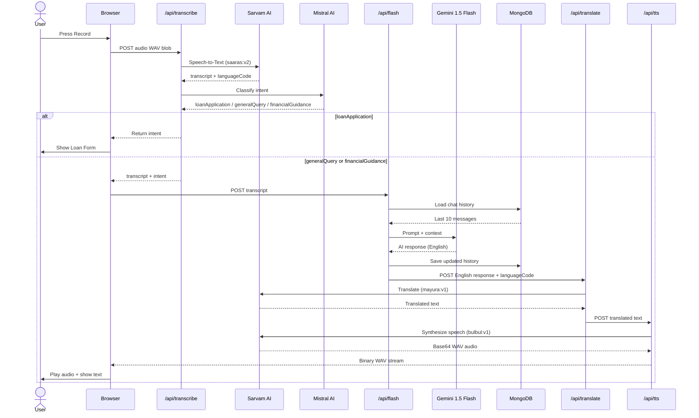

<div align="center">

<br/>

<h1>🏦 FinTok 2.0</h1>

<h3><em>AI-Powered Multilingual Financial Voice Assistant</em></h3>

<br/>

<a href="https://nextjs.org/"></a>
<a href="https://python.org/"></a>
<a href="https://flask.palletsprojects.com/"></a>
<a href="https://mongodb.com/"></a>
<a href="https://typescriptlang.org/"></a>
<a href="https://ai.google.dev/"></a>
<a href="https://sarvam.ai/"></a>
<a href="https://mistral.ai/"></a>

<br/><br/>

<p><strong>FinTok 2.0</strong> is a production-grade, voice-first financial advisory platform built to bridge the gap between AI and financial literacy across India's linguistically diverse population. Users speak naturally in <strong>any Indian language</strong>, and the platform responds with contextual financial guidance, loan eligibility checks, and application assistance — fully voiced back in their native language.</p>

<br/>

<hr/>

</div>

## 🎯 The Problem We're Solving

Over **500 million** Indians remain underserved by traditional financial services — not due to lack of need, but due to **language barriers and digital literacy gaps**. Most fintech platforms require users to:

- Read and type in English
- Navigate complex forms manually
- Understand financial jargon

**FinTok 2.0 removes all three barriers.** Users simply press a button and *talk* — in Hindi, Tamil, Telugu, Bengali, or any other Indian language — and the platform handles the rest through a fully automated AI pipeline.

---

## ✨ Key Features

| Feature | Implementation Detail |
|---|---|
| 🎙️ **Voice-First Interface** | Browser `MediaRecorder API` captures audio; no external SDK needed |
| 🌐 **Multilingual ASR** | Sarvam `saaras:v2` auto-detects language + transcribes to English |
| 🧠 **4-Class Intent Classifier** | Mistral `mistral-small-latest` routes queries with keyword fallback |
| 💬 **Contextual AI Advisor** | Gemini 1.5 Flash with rolling 10-message memory window per user |
| 🔊 **Native-Language TTS** | Sarvam `bulbul:v1` synthesizes AI response back in user's detected language |
| 🌍 **AI Translation Layer** | Sarvam `mayura:v1` translates English AI response to user's language before TTS |
| 📋 **Adaptive Loan Form** | Dynamically renders form when `loanApplication` intent is detected |
| 📚 **RAG Loan Knowledge Base** | FAISS + Cohere embeddings over 5 real bank loan PDFs |
| 🔐 **Dual Auth System** | Google OAuth 2.0 + Credentials with PBKDF2 salted password hashing |
| 💾 **Persistent Chat History** | MongoDB stores per-user conversation history linked by UUID sessions |
| ⚡ **Optimised DB Connections** | Global singleton MongoDB connection pool (maxPoolSize: 5) for serverless |

---

## 🏗️ System Architecture

FinTok 2.0 is a **polyglot full-stack application** — a Next.js 15 frontend with internal API routes acts as the primary server, while a separate Python/Flask backend handles the RAG (Retrieval-Augmented Generation) pipeline over loan documents.


---

## 🔄 Complete Voice Pipeline (End-to-End)



---

## 📁 Project Structure

```
FinTok2.0/
│
├── frontend/                          # Next.js 15 + TypeScript
│   ├── app/
│   │   ├── page.tsx                   # Main chat UI — voice record, chat bubbles, loan form
│   │   ├── layout.tsx                 # Root layout with Geist font, global metadata
│   │   ├── globals.css                # Global styles + Tailwind directives
│   │   │
│   │   ├── Components/
│   │   │   ├── Signin.tsx             # Animated auth form (sign-in + sign-up, Google OAuth)
│   │   │   ├── AudioPlayer.tsx        # Custom audio player with progress bar + controls
│   │   │   └── Form.tsx               # Dynamic loan application form (Radix UI)
│   │   │
│   │   ├── api/                       # Next.js Route Handlers (serverless functions)
│   │   │   ├── transcribe/route.ts    # Sarvam STT + Mistral intent classifier
│   │   │   ├── flash/route.ts         # Gemini AI Q&A with MongoDB chat history
│   │   │   ├── translate/route.ts     # Sarvam translation (EN → detected language)
│   │   │   ├── tts/route.ts           # Sarvam TTS → binary audio response
│   │   │   └── [...nextauth]/         # NextAuth.js catch-all auth handler
│   │   │
│   │   ├── models/
│   │   │   ├── User.ts                # Mongoose schema: email, salt, hashedPassword, oauthProvider
│   │   │   └── ChatHistory.ts         # Mongoose schema: userId, conversationId, messages[]
│   │   │
│   │   └── utils/
│   │       ├── asr_translate.ts       # Orchestrates full audio pipeline (STT → AI → TTS)
│   │       ├── flash.ts               # Gemini client: calls /api/flash → /api/translate → TTS
│   │       ├── translate.ts           # Thin wrapper around /api/translate
│   │       ├── tts.ts                 # Thin wrapper around /api/tts → returns ObjectURL
│   │       └── password.ts            # PBKDF2 salted hashing with CryptoJS (512-bit key)
│   │
│   └── lib/
│       ├── auth.ts                    # NextAuth config: Google + Credentials providers, JWT callbacks
│       ├── mongodb.ts                 # Singleton connection pool with global caching for serverless
│       └── utils.ts                   # cn() utility (clsx + tailwind-merge)
│
└── backend/                           # Python + Flask RAG server
    ├── main.py                        # Flask app: FAISS indexing + /query RAG endpoint
    ├── requirements.txt               # Python dependencies
    └── docs/                          # Knowledge base: 5 bank loan PDFs
        ├── FFB_Loan_document.pdf      # First Finance Bank loan terms
        ├── GDB_Loan_document.pdf      # GDB loan document
        ├── GGM_Loan_document.pdf      # GGM loan document
        ├── GTB_Loan_document.pdf      # GTB loan document
        └── NHB_Loan_document.pdf      # NHB loan document
```

---

## 🧠 AI & ML Stack — Deep Dive

### 1. Speech-to-Text + Language Detection
- **Model:** Sarvam `saaras:v2` via REST API
- **Why Sarvam?** Purpose-built for Indian languages; outperforms Whisper on low-resource Indian language ASR
- **Config:** `language_code: "unknown"` (auto-detect), no diarization, single speaker
- **Output:** `{ transcript, language_code }` — language code used downstream for translation + TTS

### 2. Intent Classification (NLP)
- **Model:** Mistral `mistral-small-latest`
- **Architecture:** Zero-shot classification with a structured system prompt + 4-class enum constraint
- **Robustness:** Dual-layer fallback — if Mistral returns an unexpected token, keyword matching (`"loan" + "apply"`, `"eligible"`, etc.) is used as a secondary classifier
- **Classes:** `loanApplication` | `loanEligibility` | `financialGuidance` | `generalQuery`
- **Temperature:** 0.1 — deliberately low for deterministic classification output

### 3. Conversational AI (LLM)
- **Model:** Google `gemini-1.5-flash` via `@google/generative-ai` SDK
- **Context Management:** Rolling window of last 10 messages per user session (stored in MongoDB, trimmed on every request to control token cost)
- **Session Linking:** Each conversation is identified by a `uuid` — passed from client → server → stored in DB → returned to client for continuity
- **System Instruction:** Injected via `SYSTEM_INSTRUCTION` env var — keeps Gemini focused on financial advisory

### 4. Translation
- **Model:** Sarvam `mayura:v1`
- **Source:** Always `en-IN` (AI responds in English)
- **Target:** The language code detected by `saaras:v2` in step 1 — making the round-trip fully seamless
- **Config:** `mode: "formal"`, `output_script: "fully-native"`, `numerals_format: "international"`

### 5. Text-to-Speech
- **Model:** Sarvam `bulbul:v1`
- **Speaker:** `meera` (female voice, high quality)
- **Sample Rate:** 24,000 Hz — high fidelity audio
- **Format:** The API returns base64-encoded WAV; the route decodes it to a binary buffer and streams it with correct `Content-Type: audio/wav` headers

### 6. RAG Pipeline (Python Backend)
- **Embeddings:** Cohere `embed-english-v2.0`
- **Vector Store:** Facebook FAISS (CPU) — in-memory + persisted to disk at `vectorstore/faiss_index`
- **Chunking:** `CharacterTextSplitter` with `chunk_size=1000`, `chunk_overlap=200` (prevents context loss at boundaries)
- **LLM for QA:** Google `gemini-2.0-flash` via LangChain `RetrievalQA` with `stuff` chain type
- **Knowledge Base:** 5 Indian bank loan PDFs — covers personal, home, auto, and education loans

---

## 🔐 Authentication System — Deep Dive

FinTok implements a **dual-provider authentication** system using NextAuth.js v5 (beta) with JWT sessions.

### Google OAuth 2.0
- On first Google login → a new `User` document is created in MongoDB with `oauthProvider: "google"`
- On subsequent logins → existing user is retrieved; `oauthProvider` is updated if needed
- Prevents account duplication when the same email is used via both Google and credentials

### Credentials (Email + Password)
- **Salt generation:** `CryptoJS.lib.WordArray.random(128/8)` — cryptographically secure 128-bit salt
- **Key derivation:** `CryptoJS.PBKDF2(password, salt, { keySize: 512/32, iterations: 1000 })` — industry-standard PBKDF2 with 512-bit output
- **Comparison:** Constant-time equivalent (re-hash and compare) to prevent timing attacks
- **Password validation rules:** min 8 chars, uppercase, lowercase, number, special character — enforced both client-side and implicitly server-side

### Session Strategy
- JWT-based sessions (stateless, edge-compatible)
- JWT callbacks inject `user.id` from MongoDB `_id` into token — used downstream in `/api/flash` to scope chat history per user
- Protected routes: `page.tsx` uses `useSession()` and redirects unauthenticated users to `/signin`

---

## 💾 Database Design

### `User` Collection
```ts
{
  email: String,           // unique, required — indexed
  name: String,            // required
  salt: String,            // random 128-bit hex string
  hashedPassword: String,  // PBKDF2 512-bit key
  oauthProvider: String,   // enum: ["google", "credentials"]
  createdAt: Date,         // auto (timestamps: true)
  updatedAt: Date          // auto (timestamps: true)
}
```

### `Chat` Collection
```ts
{
  userId: String,          // ref to User._id (string form of ObjectId)
  conversationId: String,  // UUID — allows multiple sessions per user
  messages: [
    {
      role: String,        // enum: ["user", "ai"]
      text: String,        // message content
      timestamp: Date      // auto
    }
  ]
}
```

### MongoDB Connection Strategy
The `connectToDb()` function implements a **global singleton pattern** critical for serverless environments (Next.js serverless functions spin up cold starts frequently):
- Checks `global.mongoose.conn` — reuses existing connection if alive
- If no connection, creates a new one with `maxPoolSize: 5`
- Caches the connection promise on `global` to prevent concurrent duplicate connections during cold starts

---

## ⚙️ API Reference

### `POST /api/transcribe`
Accepts audio file, returns transcript + language + intent.

| Field | Type | Description |
|---|---|---|
| `file` | `FormData (Blob)` | WAV audio file |

**Response:**
```json
{
  "transcript": "I want to apply for a home loan",
  "languageCode": "en-IN",
  "intent": "loanApplication",
  "rawResponse": { ... }
}
```

---

### `POST /api/flash`
Generates a contextual AI response using Gemini. Requires authenticated session.

| Field | Type | Description |
|---|---|---|
| `prompt` | `string` | User's transcribed message |
| `uuid` | `string?` | Optional conversation UUID for history continuity |

**Response:**
```json
{
  "response": "Based on your income, you may qualify for...",
  "uuid": "3f9a1b2c-..."
}
```

---

### `POST /api/translate`
Translates English text to the target language.

| Field | Type | Description |
|---|---|---|
| `input` | `string` | English text to translate |
| `target_language_code` | `string` | e.g., `"hi-IN"`, `"ta-IN"` |

---

### `POST /api/tts`
Converts text to speech audio (returns binary audio stream).

| Field | Type | Description |
|---|---|---|
| `text` | `string` | Text to synthesize |
| `language_code` | `string` | Target language code |

**Response:** Binary `audio/wav` buffer (streamed directly to client)

---

### `POST /query` *(Flask backend — port 5000)*
RAG-powered loan Q&A over bank documents.

| Field | Type | Description |
|---|---|---|
| `query` | `string` | Natural language loan question |

**Response:**
```json
{
  "query": "What is the interest rate for a home loan?",
  "answer": "Based on the NHB loan document, home loan rates start at..."
}
```

---

## 🚀 Getting Started

### Prerequisites

- **Node.js** ≥ 18
- **Python** ≥ 3.10
- **MongoDB** (Atlas free tier or local)
- API Keys: [Sarvam AI](https://sarvam.ai), [Mistral](https://mistral.ai), [Google AI Studio](https://aistudio.google.com), [Cohere](https://cohere.com)

---

### 🖥️ Frontend Setup

```bash
cd frontend
npm install
```

Create `frontend/.env.local`:

```env
# NextAuth
AUTH_SECRET=<random 32+ char string>
NEXTAUTH_URL=http://localhost:3000

# Google OAuth (from console.cloud.google.com)
GOOGLE_CLIENT_ID=your_google_client_id
GOOGLE_CLIENT_SECRET=your_google_client_secret

# MongoDB
MONGO_URI=mongodb+srv://<user>:<pass>@cluster.mongodb.net/fintok

# Sarvam AI — used for ASR, Translation, TTS
SARVAM_API_KEY=your_sarvam_api_key

# Mistral AI — used for intent classification
MISTRAL_API_KEY=your_mistral_api_key

# Google Gemini — used for conversational AI
FLASH_API_KEY=your_gemini_api_key

# System instruction injected into Gemini
SYSTEM_INSTRUCTION="You are FinTok, a multilingual financial advisor. Help users with loan applications, eligibility, and general financial guidance. Be concise, empathetic, and always respond in English regardless of input language."
```

```bash
npm run dev        # Starts on http://localhost:3000 with Turbopack
```

---

### 🐍 Backend Setup

```bash
cd backend
python -m venv venv
venv\Scripts\activate    # Windows
# source venv/bin/activate  # macOS/Linux

pip install -r requirements.txt
```

Create `backend/.env`:

```env
COHERE_API_KEY=your_cohere_api_key
GOOGLE_API_KEY=your_gemini_api_key
```

```bash
python main.py     # Starts on http://localhost:5000
```

> 💡 **On first run**, the backend reads all 5 PDFs from `docs/`, chunks them into 1000-token segments, generates vector embeddings via Cohere, and persists the FAISS index to `vectorstore/faiss_index`. Subsequent runs rebuild the index fresh.

---

## 📦 Full Tech Stack

### Frontend
| Library | Version | Purpose |
|---|---|---|
| Next.js | 15.2.2 | Full-stack React framework with App Router |
| TypeScript | 5.x | Static typing across the entire frontend |
| Tailwind CSS | 4.x | Utility-first styling |
| Framer Motion | 12.x | Page transitions, form animations, loading states |
| NextAuth.js | 5.0-beta | Authentication with JWT strategy |
| Mongoose | 8.x | MongoDB ODM for User + ChatHistory schemas |
| Radix UI | Latest | Accessible Select, Label, ScrollArea, Slot primitives |
| Lucide React | 0.482 | Icon library (Lock, Mail, User, Eye icons) |
| React Markdown | 10.x | Renders Gemini markdown responses in chat |
| React Toastify | 11.x | Toast notifications |
| CryptoJS | 4.x | PBKDF2 password hashing + salt generation |
| react-icons | 5.x | Google icon for OAuth button |

### Backend
| Library | Purpose |
|---|---|
| Flask | Lightweight REST API server |
| Flask-CORS | Cross-origin request support for Next.js frontend |
| LangChain | RAG pipeline (document loading, splitting, QA chain) |
| langchain-community | FAISS vectorstore, PyPDF loader, Cohere embeddings |
| langchain-google-genai | Gemini integration for LangChain |
| faiss-cpu | Vector similarity search over loan document embeddings |
| PyPDF2 | PDF document parsing |
| cohere | Embedding model client |
| python-dotenv | Environment variable management |
| deep-translator | Secondary translation utility |
| torch + transformers | NLP model utilities |
| SpeechRecognition + gTTS | Additional ASR/TTS utilities |

---

## 🌍 Supported Languages

FinTok 2.0 leverages Sarvam AI's Indic language models and supports automatic detection and response in:

`Hindi` · `Bengali` · `Tamil` · `Telugu` · `Marathi` · `Gujarati` · `Kannada` · `Malayalam` · `Odia` · `Punjabi` · `English (Indian)`

---

## 🧩 Key Technical Decisions

| Decision | Rationale |
|---|---|
| **Next.js API Routes as BFF** | Keeps API keys server-side; avoids exposing Sarvam/Mistral/Gemini keys to the browser |
| **Sarvam AI over Whisper** | Sarvam is specifically optimized for Indian language ASR — higher accuracy on low-resource languages like Odia, Bhojpuri |
| **Mistral for intent, Gemini for QA** | Mistral is fast and cheap for classification; Gemini is used for richer, contextual financial advisory |
| **FAISS over cloud vector DB** | Keeps the RAG backend lightweight and fully local — no Pinecone/Weaviate costs for a prototype |
| **Rolling 10-message context window** | Balances conversation coherence with Gemini token cost per request |
| **PBKDF2 over bcrypt** | CryptoJS is browser-compatible; PBKDF2 with 1000 iterations + 512-bit key provides sufficient security for this use case |
| **Singleton DB connection** | Next.js serverless functions can spin up thousands of cold starts — global caching prevents MongoDB connection exhaustion |
| **JWT sessions over DB sessions** | Stateless JWT sessions are edge-compatible and don't require a session store |

---


<a href="https://github.com/THETITAN220/FinTok2.0"></a>

</div>
